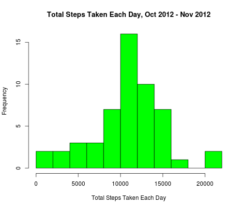
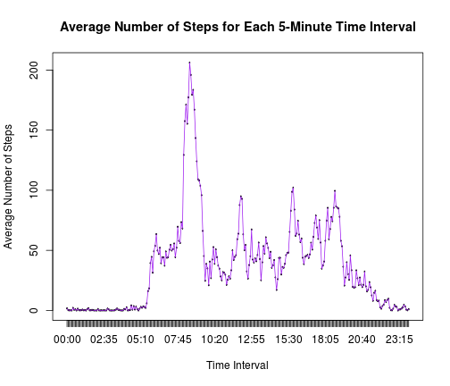
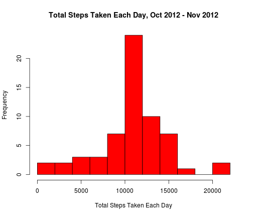
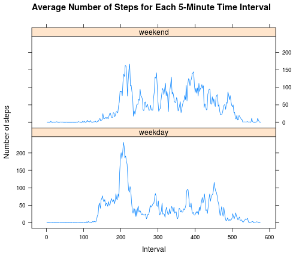

Reproducible Research Assignment 1
========================================================

#### This assignment involves data from a personal activity monitoring device, which collects data at 5 minute intervals throughout the day. 
The data consists of two months of data from an anonymous individual collected during October 2012 and November 2012. 

First, to load the libraries needed and the data:


```r
library(plyr)
library(dplyr)
```

```
## 
## Attaching package: 'dplyr'
## 
## The following objects are masked from 'package:plyr':
## 
##     arrange, count, desc, failwith, id, mutate, rename, summarise,
##     summarize
## 
## The following object is masked from 'package:stats':
## 
##     filter
## 
## The following objects are masked from 'package:base':
## 
##     intersect, setdiff, setequal, union
```

```r
library(lubridate)
```

```
## 
## Attaching package: 'lubridate'
## 
## The following object is masked from 'package:plyr':
## 
##     here
```

```r
if (!file.exists("device_data")) {
        device_data <- read.csv("activity.csv")
}             
```

To create a better-formatted interval column:

```r
device_data <- mutate(device_data, new_interval=format(as.POSIXct(sprintf("%04d", interval),  format="%H%M"), "%H:%M"))
print(head(device_data, 3))                                
```

```
##   steps       date interval new_interval
## 1    NA 2012-10-01        0        00:00
## 2    NA 2012-10-01        5        00:05
## 3    NA 2012-10-01       10        00:10
```
## The Mean Total Number of Steps Taken Per Day

We ignore the missing values in the dataset.
To calculate the total number of steps taken per day,
first separate the data frame by date and sum each day's steps:

```r
by_date <- ddply(device_data, .(date), summarize, total_steps=sum(steps))
```

The assignment wants us to understand the difference between a histogram and a barplot:
* Basically, barplots represent categorical data, while histograms represent categorical data.
* Unlike barplots, there is usually no space between adjacent columns in a histogram.
* You can talk about the skewness of a histogram (the tendency of the observations to fall more on the low end or the high end of the X axis), while skewness really has no meaning for a barplot (since the X axis does not have a low end of high end).

To make a histogram of the total number of steps taken each day:

```r
hist(by_date$total_steps, 
     col = "green", breaks=10, 
     xlab="Total Steps Taken Each Day", 
     main="Total Steps Taken Each Day, Oct 2012 - Nov 2012")
```

 

To calculate and report the mean and median of the total number of steps taken per day:

```r
steps_mean <- mean(by_date$total_steps, na.rm=TRUE)
steps_median <- median(by_date$total_steps, na.rm=TRUE)
sprintf("Mean: %s, Median: %s", steps_mean, steps_median)
```

```
## [1] "Mean: 10766.1886792453, Median: 10765"
```

## The Average Daily Activity Pattern

#### To make a time series plot (i.e. type = "l") of the 5-minute interval (x-axis) 
#### and the average number of steps taken, averaged across all days (y-axis):

First, separate the original data frame by interval:

```r
device_data$interval_factor <- factor(device_data$new_interval)
by_interval <- arrange(device_data, interval_factor)
```

To figure out the average number of steps taken for each interval:

```r
interval_ave_steps <- ddply(by_interval, .(interval_factor), 
                            summarize, mean_steps = mean(steps, na.rm = TRUE))
```

To make the plot:

```r
with(interval_ave_steps, plot(interval_factor, mean_steps, type="l",
                              xlab ="Time Interval", 
                              ylab="Average Number of Steps",
                              main="Average Number of Steps for Each 5-Minute Time Interval", 
                              col="blue"))
with(interval_ave_steps, lines(interval_factor, mean_steps, col="purple"))
```

 

#### To figure out which 5-minute interval, on average across all the days in the dataset, contains the maximum number of steps:

```r
max_steps <- filter(interval_ave_steps, mean_steps == max(mean_steps))
sprintf("Interval with the maximum number of steps: %s", max_steps[1,1])
```

```
## [1] "Interval with the maximum number of steps: 08:35"
```

## Imputing Missing Values

Note that there are a number of days/intervals where there are missing values (coded as NA). The presence of missing days may introduce bias into some calculations or summaries of the data.

To calculate and report the total number of missing values in the dataset (i.e. the total number of rows with NAs):


```r
incomplete <- device_data[!complete.cases(device_data),]
num_incomplete <- nrow(incomplete)
sprintf("Total number of rows containing missing values: %s", num_incomplete)
```

```
## [1] "Total number of rows containing missing values: 2304"
```

To fill in all of the missing values in the dataset: (Their suggestions: you could use the mean/median for that day, or the mean for that 5-minute interval.)

Filling in the missing values for steps:

```r
# Below finds out the average steps per interval of each day, but it doesn't turn out to be very useful because at least one day has complete NAs,
# which results in a NaN when you take the mean.
#by_day <- ddply(device_data, .(date), summarize, mean_day_steps = round(mean(steps, na.rm=TRUE)))
#print(head(by_day))

#Instead, to make the new value for the na's be the value of mean_steps for each specific row:

merged_frame <- merge(device_data, interval_ave_steps)
merged_frame <- arrange(merged_frame, date, interval_factor)
merged_frame[is.na(merged_frame$steps),]<-mutate(merged_frame[is.na(merged_frame$steps),], steps=mean_steps) 
```

Checking to see if there are any NAs as values in the dates column of the original data frame:


```r
missing_dates <- is.na(device_data$date)
missing_dates_num <- sum(missing_dates)
if(missing_dates_num == 0){
        print("No NAs in dates!")
} else {print("NAs in dates.")}
```

```
## [1] "No NAs in dates!"
```

Checking to see if there are any NAs as values in the intervals column of the original data frame:

```r
missing_intervals <- is.na(device_data$interval)
missing_intervals_num <- sum(missing_intervals)
if(missing_intervals_num == 0){
        print("No NAs in intervals!")
} else {print("NAs in intervals.")}
```

```
## [1] "No NAs in intervals!"
```

Checking to see that the number of rows with NAs in the steps column is equal to the total number of rows with NAs (which was calculated earlier):

```r
print(sum(is.na(device_data$steps)) == num_incomplete)
```

```
## [1] TRUE
```

Final check: Does the number of observations show that every interval is accounted for?

```r
total_rows <- nrow(device_data)
# needed_rows = (days in Oct and Nov) * hours/day * minutes/hour * interval/5 minutes
needed_rows <- (31+30) * 24 * 60 * 1/5
print(total_rows == needed_rows)
```

```
## [1] TRUE
```

To create a new dataset that is equal to the original dataset but with the missing data filled in:

```r
new_dataset <- select(merged_frame, steps, date, interval, new_interval)
print(head(new_dataset))
```

```
##       steps       date interval new_interval
## 1 1.7169811 2012-10-01        0        00:00
## 2 0.3396226 2012-10-01        5        00:05
## 3 0.1320755 2012-10-01       10        00:10
## 4 0.1509434 2012-10-01       15        00:15
## 5 0.0754717 2012-10-01       20        00:20
## 6 2.0943396 2012-10-01       25        00:25
```

To make a histogram of the total number of steps taken each day:
First separate the data frame by date and sum each day's steps:

```r
new_by_date <- ddply(new_dataset, .(date), summarize, total_steps=sum(steps))
```
Now, to plot:

```r
hist(new_by_date$total_steps, 
     col = "red", breaks=10, 
     xlab="Total Steps Taken Each Day", 
     main="Total Steps Taken Each Day, Oct 2012 - Nov 2012")
```

 

To calculate and report the new mean and median total number of steps taken per day:

```r
new_steps_mean <- mean(new_by_date$total_steps)
new_steps_median <- median(new_by_date$total_steps)
sprintf("New Mean: %s, New Median: %s", new_steps_mean, new_steps_median)
```

```
## [1] "New Mean: 10766.1886792453, New Median: 10766.1886792453"
```

Do these values differ from the estimates from the first part of the assignment?

```r
mean_change <- abs(steps_mean - new_steps_mean)
median_change <- abs(steps_median - new_steps_median)
sprintf("Change in Mean: %s, Change in Median: %s", mean_change, median_change)
```

```
## [1] "Change in Mean: 0, Change in Median: 1.1886792452824"
```
The mean does not differ because when you add more instances with the mean value, the mean stays the same.
The median differs slightly because adding instances of the mean value allows the mean value to be a possibility of the median value, and it is in the middle.

What is the impact of imputing missing data on the estimates of the total daily number of steps? 
In this case, using the interval mean, there is little impact.  Other ways to substitute for missing data might have more of an impact.

## Differences in Activity Patterns Between Weekdays and Weekends

Using the dataset with the filled-in missing values:
To add a variable that corresponds to the day of week for each date:

```r
library(lubridate)
new_dataset <- mutate(new_dataset, date2=ymd(date), day_of_week = wday(date2))
#print(head(new_dataset))
```

To create a new factor variable in the dataset with two levels – “weekday” and “weekend” indicating whether a given date is a weekday or weekend day:

```r
new_dataset$day_factor <- ifelse((new_dataset$day_of_week == 1| new_dataset$day_of_week == 7), "weekend", "weekday")
#print(head(new_dataset))
```

To make a panel plot containing a time series plot (i.e. type = "l") of the 5-minute interval (x-axis) and the average number of steps taken, averaged across all weekday days or weekend days (y-axis). See the README file in the GitHub repository to see an example of what this plot should look like using simulated data.

First, separate the data frame by interval:

```r
new_dataset$interval_factor <- factor(new_dataset$new_interval)
new_by_interval <- arrange(new_dataset, interval_factor)
```

To figure out the average number of steps taken for each interval:

```r
new_interval_ave_steps <- ddply(new_by_interval, .(interval_factor, day_factor), 
                            summarize, mean_steps = mean(steps))
print(head(new_interval_ave_steps))
```

```
##   interval_factor day_factor mean_steps
## 1           00:00    weekday 2.25115304
## 2           00:00    weekend 0.21462264
## 3           00:05    weekday 0.44528302
## 4           00:05    weekend 0.04245283
## 5           00:10    weekday 0.17316562
## 6           00:10    weekend 0.01650943
```

To make the plot:

```r
library(lattice)
xyplot(mean_steps ~ seq_along(interval_factor)| day_factor, data=new_interval_ave_steps, 
       layout=c(1,2), 
       type="l",
       xlab="Interval",
       ylab="Number of steps",
       main="Average Number of Steps for Each 5-Minute Time Interval"
       )
```

 

